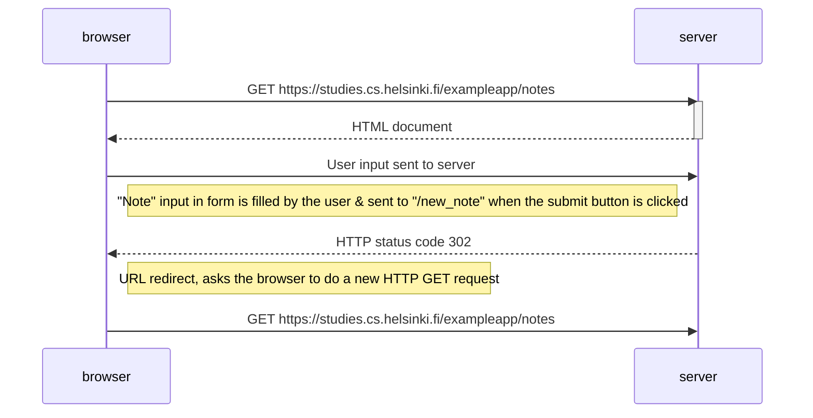

```mermaid
sequenceDiagram
    participant browser
    participant server

    browser->>server: GET https://studies.cs.helsinki.fi/exampleapp/notes
    activate server
    server-->>browser: HTML document
    deactivate server

    browser->>server: User input sent to server

    Note right of browser: "Note" input in form is filled by the user & sent to "/new_note" when the submit button is clicked

    server-->>browser: HTTP status code 302

    Note right of browser: URL redirect, asks the browser to do a new HTTP GET request
    
    browser->>server: GET https://studies.cs.helsinki.fi/exampleapp/notes
    
```