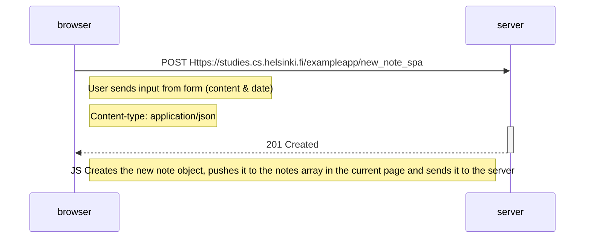

```mermaid
sequenceDiagram
    participant browser
    participant server


    browser->>server: POST Https://studies.cs.helsinki.fi/exampleapp/new_note_spa
    Note right of browser: User sends input from form (content & date)
    Note right of browser: Content-type: application/json

    activate server
    server-->>browser: 201 Created
    deactivate server

    Note right of browser: JS Creates the new note object, pushes it to the notes array in the current page and sends it to the server

```